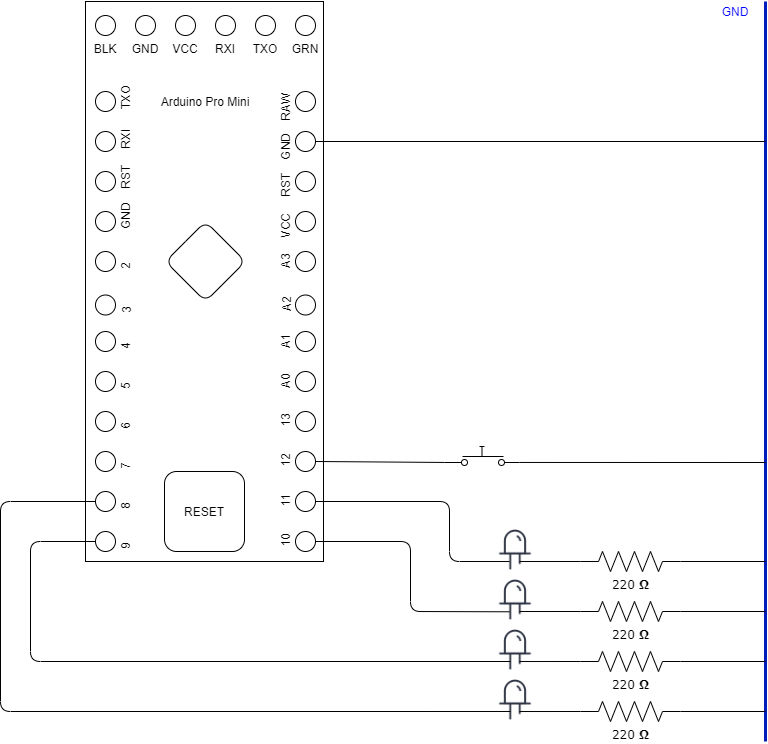

Pulsador que intercambia modos de operacion:
suma binaria o bien encendido/apagado de LEDS.

Utiliza pines 8, 9, 10 y 11 como salida
lectura en pin 12 en modo pull-up con pulsador.

A diferencia del ejercicio 2 el cambio en el
voltaje del pin 12 provoca una interrupcion
que activa el cambio de modo.

Pasos:

1. make clean
2. make
3. make flash

Presionar el boton de reset un tiempo y soltar,
repetir si no funciona.
