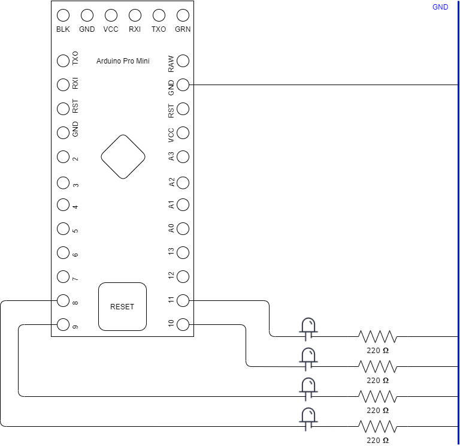

Enciende y apaga leds para conseguir el efecto del knight-rider.

Pines 8, 9, 10 y 11. Sin pulsador.

Pasos:

1. make clean
2. make
3. make flash

Presionar el boton de reset un tiempo y soltar,
repetir si no funciona.
