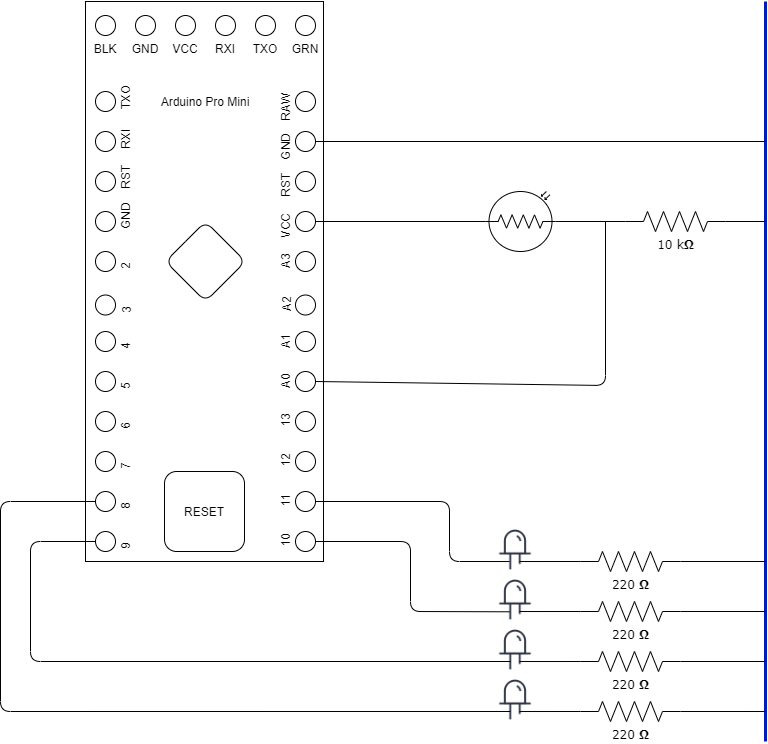

Implementa driver para periferico ADC.
Utiliza UART para enviar datos a los LEDS
los cuales se encienden segun el valor leido.

Pasos:

1. make clean
2. make
3. make flash

Presionar el boton de reset un tiempo y soltar,
repetir si no funciona.
